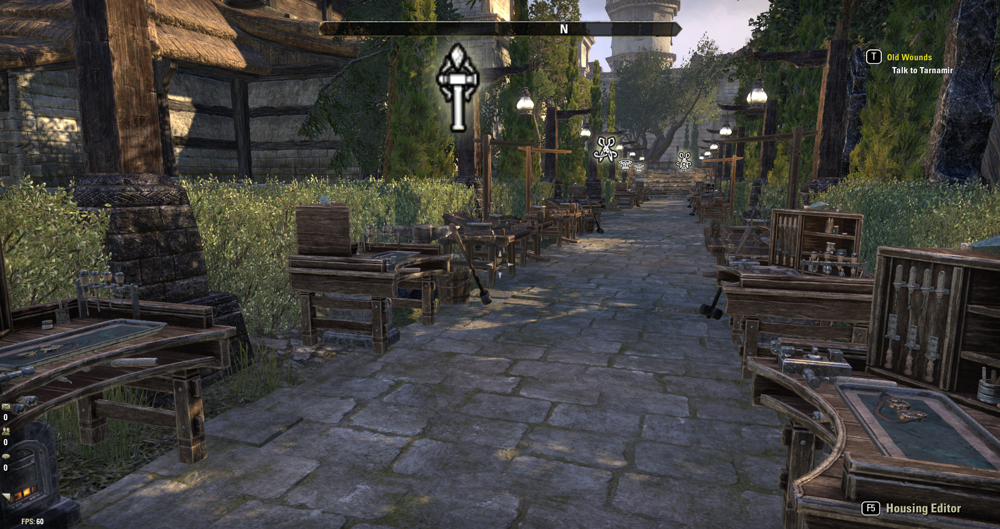

# Home Station Marker

An add-on for Elder Scrolls Online that draws 3D markers over crafting stations in a player home.



Adapted from [Shinni's HarvestMap](https://www.esoui.com/downloads/info57-HarvestMap.html) and [Marify's Confirm Master Writ](https://www.esoui.com/downloads/info2160-ConfirmMasterWrit.html).

Originally written to help visitors find stations when crafting master writs with [WritWorthy](https://www.esoui.com/downloads/info1605-WritWorthy.html).

# Libraries

## Required Libraries:

- [Shinni's Lib3d-v3](https://www.esoui.com/downloads/info1664-Lib3D-v3.html)

## Optional Libraries, recommended:

- [Baertram's LibSets](https://www.esoui.com/downloads/info2241-LibSets.html)
  Allows you to type `/hsm Alessia cl` instead of `/hsm 82 2` for Alessia's Bulwark clothier station.

# FAQ

## Why don't I see any markers?

HomeStationMarker starts out not knowing any station locations. Once it has some station locations recorded to SavedVariables, it can show markers for those stations.

1. Run around the player house and interact with a few crafting stations, such as Enchanting or Armor Master Blacksmithing.
2. `/hsm enchanting` or `/hsm armor bs` to show the above marker.
   (This command requires [Baertram's LibSets](https://www.esoui.com/downloads/info2241-LibSets.html).)

In your own house, or any house in which you are trusted enough to have "Decorator" access, you can replace step 1 with `/hsm scanlocs` to immediately teach HomeStationMarker the location of every crafting station in the house.

Learning a station location _after_ requesting a marker for it will not show a marker for that station. The marker will appear next time you enter the house or `/reloadui`.

## Why are the markers not perfectly aligned with their stations?

When HomeStationMarker records a crafting station's location from you interacting with that station, HomeStationMarker actually records your player's position, not the crafting station's.

The API to learn a station's location is restricted to a house's owner or guests with "Decorator" access. For all other players, this is as close as I can get it.

# Slash Commands

A few commands to help while testing, probably not useful to players:

### `/hsm <station> <set>`
Toggle a marker above the given station. Can omit either argument.

- `/hsm alchemy` toggles a marker over an alchemy station
- `/hsm alessia's blacksmithing` toggles a marker over the Alessia's Bulwark blacksmithing station

This is mostly for testing/debugging this add-on. The simplistic string matching here was designed for, and tested on, EN English only. If it doesn't work in DE German, sorry.

Requires [Baertram's LibSets](https://www.esoui.com/downloads/info2241-LibSets.html)

#### Crafting station abbreviations

Nobody wants to type "Jewelry Crafting Station".

- two-letters: bs, cl, ww, jw, al, en, pr
- first few letters: black, cloth, wood, jewel

#### Set abbreviations

- first few letters: alessia, twice-born, eternal
- tbs, nmg, juli, kags, seducer

Uppercase and punctuation ignored.

### `/hsm forgetlocs [all]`

Forget all station locations for current house, or all houses if `/hsm forgetlocs all`. Use `/hsm forgetlocs` in a house after moving any crafting stations. Deletes all markers in current house (or all houses if `/hsm forgetlocs all`) as a necessary side effect.

### `/hsm scanlocs`

Teach HomeStationMarker the location of every crafting station in this house.

Requires "Decorator" access, which you automatically have in your own houses, and rarely ever have in anybody else's house.

# Not Supported

Partial support already exists for additional stations:
- Transmute station
- Mundus stones
- Assistants: Banker, Merchant, Fence

### I have no desire to add these ever:

- custom markers
- colors
- per-add-on sets of markers

No thank you. That's an additional API and complexity that I don't want to spend my days supporting.

# API

```
HomeStationMarker.AddMarker(setId, stationId)
    Increment ref count for <setId, stationId>.
    Show a marker for that station if in player housing and its
    location is known.
    Return true if shown, false if not shown or was already shown.

HomeStationMarker.DeleteMarker(setId, stationId)
    Decrement ref count for <setId, stationId>.
    Hide any marker for that station if refcount hits 0.
    Return true if refcount hit zero and there was a request for that marker.

HomeStationMarker.DeleteAllMarkers()
    Reset all ref counts to zero.
    Delete all requests for markers.
    Hide any markers.

- setId:     integer set bonus ID, such as 82 for Alessia's Bulwark.
             nil or string "no_set" for set-less stations such as Alchemy
             or Enchanting.

- stationId: integer crafting type such as CRAFTING_TYPE_BLACKSMITHING or 1.
```

## Why RefCount?

Reference counts free up other code from worrying about whether they need a station for two or more crafting requests, and whether the completion of a request means it is time to remove the marker or not. Let the refcounts do the worrying for you.

Ref counts also help if multiple add-ons use HomeStationMarker: what if WritWorthy needed a station, but some other add-on also needed that same station. If either one removed the marker, the other add-on's requested marker would end up lost.

## RefCount/Marker Desync

The above 3 API functions are the only ones that touch or see the ref counts.
Slash commands such as `/hsm <set> <station>` bypass the ref count and toggle the marker regardless of API requests.

# FPS Cost

Each marker slows down your frames per second.

This add-on also slows down frames per second while in player housing:

`zo_callLater` : a periodic task updates each marker rotation 8 times per second. Only registered within player housing.

`EVENT_CRAFTING_STATION_INTERACT` : An event listener records station location each time you interact with a crafting station. This listener is only registered within player housing.

`EVENT_PLAYER_ACTIVATED` : An event listener hides all of a house's markers when you exit player housing, shows that house's previously hidden markers when you enter player housing.

Scene Listener : An event listener that shows/hides all markers when the HUD is shown/hidden while in player housing. Hides the markers when you're in the inventory/bank/dialog/whatever scene, unhides when you're back to walking around the house.

# SavedVariables

- **station locations:** for each player house: each known crafting station's location
- **requested markers:** list of set and station ids for each requested marker
- **reference counts:** keep track of how many times a marker has been requested via API.

# To Do

- Stop replacing `/hsm scanlocs` station location records every time you interact.
  Add a "provenance" field to location records and then honor "scan" before "interact."
- Event listener to detect and record assistant and mundus stone locations.
- Slash command support to toggle above assistant and mundus stone locations.